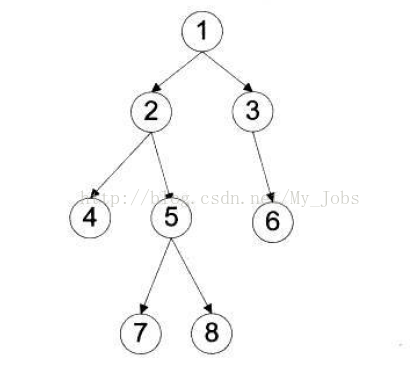

前序遍历：根结点 ---> 左子树 ---> 右子树

中序遍历：左子树---> 根结点 ---> 右子树

后序遍历：左子树 ---> 右子树 ---> 根结点

层次遍历：只需按层次遍历即可

例如，求下面二叉树的各种遍历

前序遍历：1  2  4  5  7  8  3  6

中序遍历：4  2  7  5  8  1  3  6 

后序遍历：4  7  8  5  2  6  3  1

层次遍历：1  2  3  4  5  6  7  8

